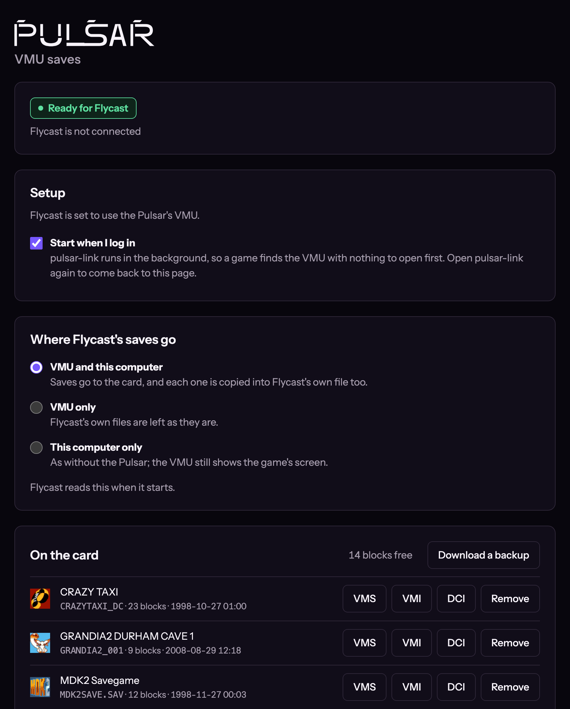

# Pulsar Link

[](https://github.com/alwaysEpic/pulsar-link/actions/workflows/ci.yml)
[](LICENSE)


Play Flycast with the VMU in your [Pulsar](https://pulsar.alwaysagog.com/) controller: the
game's screen on the VMU, and your saves on it too. Pulsar Link runs in the background on your
computer, and a page in your browser backs up, restores, adds and exports the saves on that VMU.

Install once, pair the controller as usual, play.



> **Where to get Pulsar Link.** The only official source is this repository's
> [Releases](https://github.com/alwaysEpic/pulsar-link/releases) page. Copies of Pulsar repos on
> other GitHub accounts that offer a "download" have been found carrying malware. Don't run them.

## Features

- The game's VMU screen on the VMU docked in your Pulsar, while you play in Flycast
- Saves go to the VMU, to your computer, or both; Flycast's own save files are never erased
- Saves reach the VMU in the background, so Flycast never waits; a save survives a dropped
  link or a quit, and is finished next time
- A save manager page: back up the whole card, restore it, add and remove saves (`.vms`/`.vmi`,
  `.dci`, or picked from a card image), download any save
- Starts at login and stays out of the way; open it again to get to the page
- Copies into Flycast's per-game VMU files, telling the game from its disc (GDI, cue/bin, CDI,
  CHD)

## How it works

- Flycast (v2.7 and later) can hand a controller port's VMU to a program on the same machine
  over a local TCP port. Pulsar Link listens there.
- It talks to the Pulsar over Bluetooth LE through the controller's host service, on the
  connection the computer already holds for the gamepad. No second pairing.
- Flycast expects a reply within 100 ms, and the controller reads its VMU far slower than
  that. So Pulsar Link keeps a copy of the card on disk, answers Flycast from it, and writes
  changes to the VMU in the background, keeping them in a journal until they are on it.

## Requirements

- A [Pulsar](https://github.com/alwaysEpic/pulsar-dreamcast-ble) controller with current
  firmware ([update here](https://pulsar.alwaysagog.com/update)), paired with your computer, and
  a VMU docked in it
- [Flycast](https://github.com/flyinghead/flycast) v2.7 or later (standalone)
- macOS 11 or later, or Windows 10 or 11 (x86_64). Linux (BlueZ) builds and runs but is less
  tested; Batocera is coming.

## Install

### macOS

1. Download `pulsar-link-macos.dmg` from [Releases](https://github.com/alwaysEpic/pulsar-link/releases)
   and drag **Pulsar Link** into Applications.
2. Open it from Applications, and allow Bluetooth when asked.
3. The page opens in your browser. With Flycast closed, choose **Set up Flycast** under
   **Setup**. That's it: Pulsar Link now starts when you log in.

### Linux

It needs BlueZ and the D-Bus library, which any Linux desktop with Bluetooth already has
(`libdbus-1-3` on Debian and Ubuntu, `dbus-libs` on Fedora).

1. Download `pulsar-link-linux-x86_64.tar.gz` (or `-aarch64`) from
   [Releases](https://github.com/alwaysEpic/pulsar-link/releases) and unpack it where it will
   stay, such as `~/.local/opt`, which gives a `pulsar-link` folder. Not
   `~/.local/share/pulsar-link`: that is where it keeps your cards and backups.
2. Run `./pulsar-link` in that folder. It sets itself to start at login (a systemd user
   service) and opens the page; choose **Set up Flycast** there.

### Windows

The Windows build is **not code-signed** yet, so Windows warns before the first run.

1. Download `pulsar-link-windows-x86_64.zip` from
   [Releases](https://github.com/alwaysEpic/pulsar-link/releases). Before unzipping, open the
   zip's **Properties** and tick **Unblock**, so Windows does not stop the program that starts
   it at login. Then extract it where it will stay, such as `%LOCALAPPDATA%\Programs`, which
   gives a `pulsar-link` folder. Keep its files together: `pulsar-link-background.exe` is what
   starts it at login without a window.
2. Run `pulsar-link.exe`. If Windows says it protected your PC, choose **More info**, then
   **Run anyway**. It sets itself to start at login and opens the page.
3. Flycast on Windows keeps its settings beside `flycast.exe`, which Pulsar Link cannot find
   yet, so set Flycast by hand, with Flycast's VMU in port A's first slot: **Settings →
   Controls →** that slot → **DreamPotato**, and tick **Use Physical VMU Storage** for saves
   on the VMU. On the page, choose **VMU only** under where saves go: copying saves into
   Flycast's own files is not supported on Windows yet.

## Using it

The page lives at [http://127.0.0.1:37380](http://127.0.0.1:37380); open Pulsar Link again to
get back to it. Start a game once the page says **Ready**: Flycast decides when a game starts
whether to use the VMU.

**Where saves go** is set on the page:

| Setting | Saves go to |
|---|---|
| **VMU and this computer** (default) | the VMU, and each one is copied into Flycast's own file |
| **VMU only** | the VMU; Flycast's files are left as they are |
| **This computer only** | Flycast's own files, as without a Pulsar; the VMU still shows the screen |

Saves go on the VMU while the controller is left alone: the Pulsar writes to its VMU only once
the pad has been still for about a second, so a save made mid-game waits for the next pause.
Until then it is kept on this computer, through a quit or a crash, and the page counts it as on
the way.

A save made before the VMU was ready lands in Flycast's own file; the page lists it and puts it
on the VMU in one click. `pulsar-link --help` lists the command-line tools.

## Stopping it

- **Stop it now:** on the page, **Stop pulsar-link**. It starts again the next time you log
  in, or when you open Pulsar Link.
- **Stop it, and not at login:** untick **Start when I log in** on the page, then **Stop
  pulsar-link**. Open Pulsar Link again any time to start it.
- **Not at login, but running for now:** untick **Start when I log in** and leave it running
  until you log out.
- **Without the page:** run `uninstall`, which stops it and keeps it from starting at login.
  - macOS, in Terminal: `"/Applications/Pulsar Link.app/Contents/MacOS/pulsar-link" uninstall`
  - Windows, in Command Prompt: `"%LOCALAPPDATA%\Programs\pulsar-link\pulsar-link.exe" uninstall`
    (or wherever you extracted it)
  - Linux, in its folder: `./pulsar-link uninstall`
- **Remove it entirely:** run `uninstall` first, then delete the program: on macOS, drag
  **Pulsar Link** from Applications to the Trash; on Windows and Linux, delete the files you
  extracted (`pulsar-link` or `pulsar-link.exe` and `pulsar-link-background.exe`, `README.md`,
  `LICENSE`, `THIRD-PARTY-NOTICES.txt`). Your cards, backups and settings are kept apart, in
  `~/Library/Application Support/pulsar-link` (macOS), `%APPDATA%\pulsar-link` (Windows) or
  `~/.local/share/pulsar-link` (Linux). If you extracted the program into that same folder,
  delete only its files there, not `cards`, `backups` or `settings.cfg`; delete the whole folder
  only if you want your saves gone too.

## For Developers

### Building from Source

```bash
cargo build --release -p pulsar-link    # Linux needs libdbus-1-dev and pkg-config
./scripts/bundle-macos.sh               # macOS: target/bundle/Pulsar Link.app
```

### Running Checks

```bash
./scripts/gate.sh          # formatting, clippy, tests, the build: what CI runs
./scripts/page_checks.sh   # the page at every width, 200% text, contrast (needs Chrome)
```

### Architecture

- **`crates/vmu-card/`** — the VMU card image, its filesystem and the save formats. No I/O
  and no async; tested on the host.
- **`crates/pulsar-link/`** — the program: the Bluetooth link to the Pulsar, the server Flycast
  connects to, the write-behind journal, the page, and starting at login on each OS.

## Releases

Each [release](https://github.com/alwaysEpic/pulsar-link/releases) is built by GitHub Actions
from its tag:

- **`pulsar-link-macos.dmg`** — the app for macOS (Apple silicon and Intel), signed and
  notarized
- **`pulsar-link-linux-x86_64.tar.gz`**, **`pulsar-link-linux-aarch64.tar.gz`** — Linux
- **`pulsar-link-windows-x86_64.zip`** — Windows, not yet code-signed

## Related projects

- **[Pulsar](https://github.com/alwaysEpic/pulsar-dreamcast-ble)** — the controller's firmware:
  your Dreamcast controller as a Bluetooth gamepad, which also lends its VMU to Pulsar Link.
- **[Pulsar Maple Bridge](https://github.com/alwaysEpic/pulsar-maple-bridge)** — the other
  way round: the Pulsar on a real Dreamcast, through a Pico2Maple dongle, with the same VMU
  screen and memory card.

## Contributing

Contributions are welcome! See [CONTRIBUTING.md](CONTRIBUTING.md).

## License

This project is licensed under the [GNU General Public License v3.0 or later](LICENSE).
